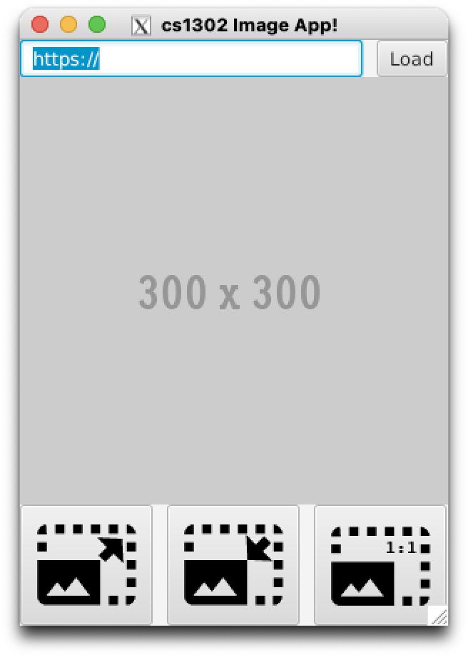

# cs1302-hw7.6 Fancy ImageApp


> The artist is the creator of beautiful things.
> **-- Oscar Wilde, _The Picture of Dorian Gray_**

This class exercise continues the development a GUI app using the JavaFX library. Students
will continue to create an interactive GUI that loads an image from a specified URL and allows
the user to perform different resizing operations. Construction of this app requires students
to utilize their knowledge of inheritance, polymorphism, interfaces, and API documentation
lookup.

## Course-Specific Learning Outcomes

* **LO2.e:** (Partial) Utilize existing generic methods, interfaces, and classes in a software solution.
* **LO7.a:** (Partial) Design and implement a graphical user interface in a software project.

## References and Prerequisites
* [CSCI 1302 JavaFX Tutorial](https://github.com/cs1302uga/cs1302-tutorials/blob/alsi/javafx/javafx.md)
* [JavaFX Bookmarks](https://github.com/cs1302uga/cs1302-tutorials/blob/master/javafx/javafx-bookmarks.md)
* [JavaFX API Documentation](https://openjfx.io/javadoc/17/)

## Questions

In your notes, clearly answer the following questions. These instructions assume that you are 
logged into the Odin server. 

**NOTE:** If a step requires you to enter in a command, please provide in your notes the full 
command that you typed to make the related action happen. If context is necessary (e.g., the 
command depends on your present working directory), then please note that context as well.

### Getting Started

1. Use Git to clone the repository for this exercise onto Odin into a subdirectory called `cs1302-hw7.6`:

   ```
   $ git clone --depth 1 https://github.com/cs1302uga/cs1302-hw7.6.git
   ```

## Exercise Steps

### Checkpoint 1 Steps

1. Execute `tree src` from within the `cs1302-hw7.6` directory you just created to see the provided source files. Then, take a few
   minutes to look through the code and understand what you were given.
   
1. Compile and run the code using the provided compile script (`compile.sh`).

1. Enter an invalid URL into the `TextField` and click the load button. The starter code includes a method called `alertError`
   that displays an error message within an `Alert` window. Take a minute to look over the code in that method.

1. Consider the following screenshot and associated containment heirarchy:

   <table>
   <tr>
      <td></td>
      <td><pre><code>            Stage
                 |
               Scene
                 |
               VBox
                 |
               /---\---------\
              /     \         \
            HBox  ImageView  HBox
            / \               |
           /   \            /---\-----\
    TextField  Button      /     \     \
                      Button Button Button
                      /      /           \
                 ImageView ImageView ImageView</code></pre></td>
   </tr>
   </table>
   
   Each node corresponds to an object of some class under the 
   [`javafx`](https://openjfx.io/javadoc/17/)
   package. The diagram for the scene graph assumes that child nodes
   are added to their parents in a left-to-right order.
   Here are some additional notes:
   
   * The textfield is expected to grow with its parent `HBox`.
   
   * The three buttons at the bottom should grow to fill their enclosing `HBox`. Buttons require an
     extra step that was not needed with textfields. To get this to work, make sure you read and 
     understand all of the starter code in the 
     [`Hbox` Documentation](https://openjfx.io/javadoc/17/javafx.graphics/javafx/scene/layout/HBox.html)
   
   * The three `ImageView` objects associated with the `Button` objects 
      via each `Button` object's `graphic` property. 

   * The icons for the associated images are contained in the `resources` directory 
     provided with this exercise. To use these local files in your `ImageView`, you
     can use a relative `file:` URL, e.g., `file:resources/image.png` -- this will only work
     if resources is in the present working directory when the app is run. There is an example
     of this in the `init` method in the starter code. There, we initialize the default image
     from the `resources` directory.
             
1. Update your code so that it has the same scene graph and visual
   appearance provided in the previous step. The three new buttons below the main `ImageView` 
   object are not supposed to function for this checkpoint. 
   **Recompile before continuing.**
   Also, make sure your code passes the `checkstyle` audit, then stage and commit all changes.

If you completed the steps correctly, your app should look similar to
the screenshot provided above. Congratulations on a good looking app!
   
<hr/>


<hr/>

### Checkpoint 2 Steps

1. Now that you have your app looking good, let's make it do stuff. Add
   the functionality listed below to your app. 

   You will need to consult the API documentation for the 
   [`ImageView`](https://openjfx.io/javadoc/17/javafx.graphics/javafx/scene/image/ImageView.html)
   and
   [`Button`](https://openjfx.io/javadoc/17/javafx.controls/javafx/scene/control/Button.html). 
   
   While reading the documentation, carefully consider how the following properties impact an `ImageView`:
     * [`fitHeight`](https://openjfx.io/javadoc/17/javafx.graphics/javafx/scene/image/ImageView.html#fitHeightProperty)
     and [`preserveRatio`](https://openjfx.io/javadoc/17/javafx.graphics/javafx/scene/image/ImageView.html#preserveRatioProperty).

   * Here are some URLs to try when testing your program:

     * `http://csweb.cs.uga.edu/~mec/cs1302/gui/pikachu.png`
     * `http://csweb.cs.uga.edu/~mec/cs1302/gui/brad.jpg`
     * `http://csweb.cs.uga.edu/~mec/cs1302/gui/SuccessKid.jpg`
     
   **Please read all of the bullet points below as well as the recommendations before writing any code.**

   * __Increase Size (Enlarge):__
     The first button (i.e., the one with [`photo_size_enlarge.png`](resources/photo_size_enlarge.png))
     should _increase_ the size of the main `ImageView` object by some fixed amount.
     
     * If clicking this button causes the size to increase to an amount such that a 
       subsequent click would cause the `ImageView` size to exceed twice the size of the 
       underlying `Image`, then disable the button. If the second button (i.e., for
       decreasing size) is disabled, then enable it.

   * __Decrease Size (Shrink):__
     The second button (i.e., the one with [`photo_size_shrink.png`](resources/photo_size_shrink.png))
     should _decrease_ the size of the main `ImageView` object by some fixed amount. 
     
     * If clicking this button causes the size to decrease to an amount such that a 
       subsequent click would cause the `ImageView` size to become negative, then 
       disable the button. If the first button (i.e., for
       increasing size) is disabled, then enable it.

   * __Actual Size:__
     The third button (i.e., the one with [`photo_size_actual.png`](resources/photo_size_actual.png))
     should return the main `ImageView` object to its default size. This can be accomplished by changing the size 
     of the `ImageView` object to the same size as the `Image` object it displays. 
     
     * If either of the other buttons (i.e., for increasing / decreasing size) are disabled, 
       then enable them.
     
   Recommendations:
   
   * Instead of writing the increase / decrease size logic entirely in separate lambda expressions,
     write a `private` resize method that takes your fixed resize amount as a positive or negative 
     `double` and simply have the lambdas for your event handlers call that method with the
     appropriate value. For example: 
     
     ```java
     someButton.setOnAction(e -> resize(+25));
     ```
   
1. **Recompile before continuing.**
   Also, make sure your code passes the `checkstyle` audit, then stage and commit all changes.
     
If you completed the steps correctly, your app should not only look 
similar to the screenshot provided above, but it has the desired
functionality. Congratulations on a good looking, functional app!
        
<hr/>


<hr/>

### Submission Steps

**Each student needs to individually submit their own work.**

1. Create a plain text file called `SUBMISSION.md` directly inside the `cs1302-javafx`
   directory with the following information:

   1. Your name and UGA ID number
  
   Here is an example of the contents of `SUBMISSION.md`.
   
   ```
   Sally Smith (811-000-999)
   ```

1. Change directories to the parent of `cs1302-hw7.6` (e.g., `cd ..` from `cs1302-hw7.6`). If you would like
   to make a backup tar file, the instructions are in the submissions steps for [hw01](https://github.com/cs1302uga/cs1302-hw01).
   We won't repeat those steps here and you can view them as optional.
   
1. Use the `submit` command to submit this exercise to `csci-1302`:
   
   ```
   $ submit cs1302-hw7.6 csci-1302
   ```
   
   Read the output of the submit command very carefully. If there is an error while submitting, then it will displayed 
   in that output. Additionally, if successful, the `submit` command creates a new receipt file in the directory you 
   submitted. The receipt file begins with rec and contains a detailed list of all files that were successfully submitted. 
   Look through the contents of the rec file and always remember to keep that file in case there is an issue with your submission.

   **Note:** You must be on Odin to submit.

<hr/>


<hr/>

[](http://creativecommons.org/licenses/by-nc-nd/4.0/) [](http://creativecommons.org/licenses/by-nc/4.0/)

<small>
Copyright &copy; Michael E. Cotterell, Bradley J. Barnes, and the University of Georgia.
This work is licensed under 
a <a rel="license" href="http://creativecommons.org/licenses/by-nc-nd/4.0/">Creative Commons Attribution-NonCommercial-NoDerivatives 4.0 International License</a> to students and the public and licensed under
a <a rel="license" href="http://creativecommons.org/licenses/by-nc/4.0/">Creative Commons Attribution-NonCommercial 4.0 International License</a> to instructors at institutions of higher education.
The content and opinions expressed on this Web page do not necessarily reflect the views of nor are they endorsed by the University of Georgia or the University System of Georgia.
</small>
